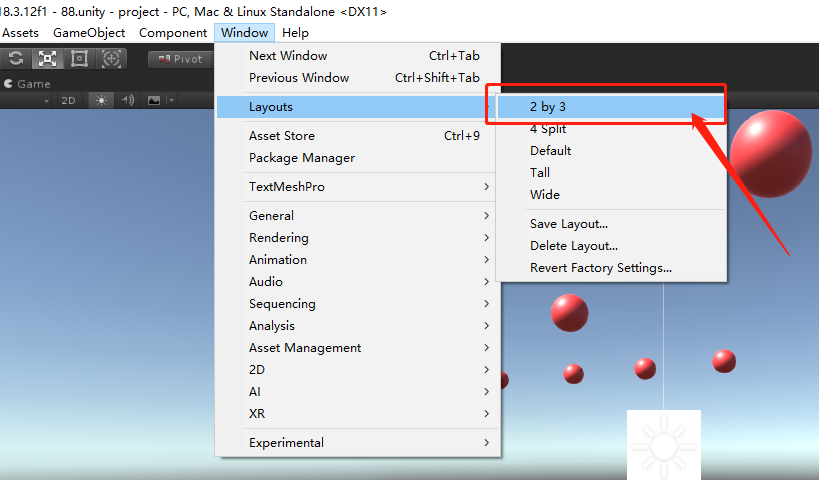
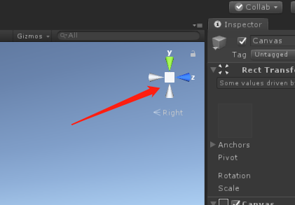
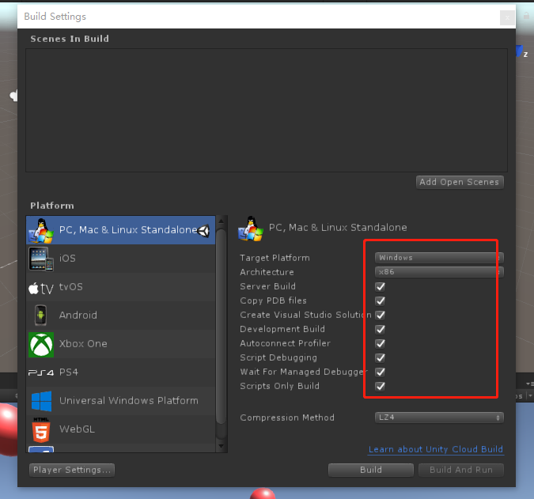

### unity git 测试
> UNITY 版本: 2018.3.12F1
> 日期: 2020.4.3
> 测试电脑: 联想

#### 1、增加操作
- [x] 图片
- [x] 材质
- [X] 游戏对象
- [X] 文件夹
- [X] 脚本
- [X] 场景
- [X] 直线光
- [X] canvas
- [X] 增加 FBX模型
- [X] 增加自定义包(Assets -> Import Package -> Custom Package)
- [X] 从AssetStore导入资源

测试结果: git 均可检测到变化。

#### 2、改变操作
- [x] 改变游戏对象位置
- [x] 改变游戏对象名字
- [x] 为游戏对象挂载脚本
- [x] 改变材质贴图
- [x] 改变图片属性
- [x] 改变场景-增加游戏对象
- [x] 改变场景-删除游戏对象
- [X] 改变脚本内容
- [X] 改变文件夹名字
- [X] 删除文件夹
- [X] 修改Canvas-Text文本内容
- [X] 改变工程配置(Edit -> Project Settings -> Audio 第一项)

测试结果: git 均可检测到变化。

#### 3、git 操作
- [X] 切换分支
- [X] 分支合并

测试结果: git操作后对应UNITY项目可以正确加载改变后的场景。

#### 4、git不能检测的内容
以下项目设置后git检测不到变化。
- [X] 编辑器设置(改变窗口布局)

- [X] 改变视图

- [x] Build Settings

结论: 一些本地操作设置,不会对运行结果产生影响的操作,不会被git检测到变化。

<全文结束>